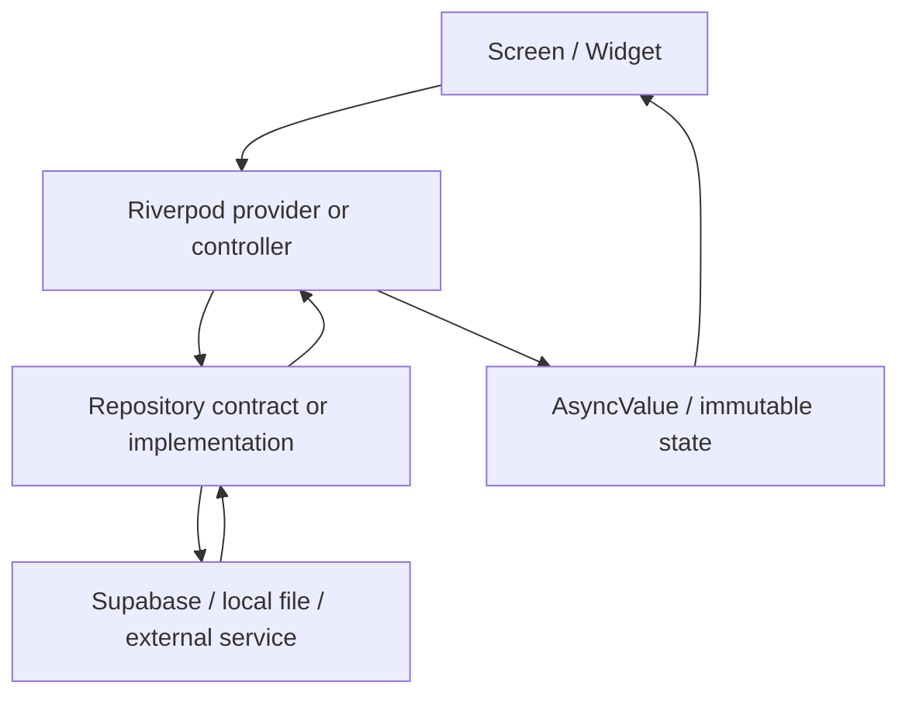

# Architecture & Data Flow

**Confidence / Verification Status**: `VERIFIED AGAINST SOURCE`
**Last source audit**: `2026-07-10`

## Architecture style

Moniary is feature-first with lightweight Clean Architecture boundaries:

1. **Presentation**: widgets/screens render localized UI and observe providers.
2. **Application**: Riverpod notifiers/controllers orchestrate mutations and
   invalidate dependent queries.
3. **Domain**: pure models, repository contracts, and calculation services.
4. **Data**: repository implementations, Supabase data sources, local file
   storage, and external services.

Some older/simple modules combine repository and data-source responsibilities in
one data-layer class. Do not bypass that class from UI, and do not rewrite the
architecture solely to make every feature structurally identical.

## Data flow

## Production-only data mode

Runtime repositories use Supabase and must fail closed when required
configuration is missing. There is no demo session or mock-data fallback.
Anonymous users are real Supabase Auth users and access data through the same
RLS-protected repositories as email and OAuth users.

## Query and mutation convention

- Read models with `Provider`, `FutureProvider`, `StreamProvider`, and family
  variants.
- Perform mutations through a controller/notifier.
- On success, invalidate the affected query providers (including the exact
  family key, such as a normalized month or entity ID).
- Do not start side effects from widget `build()`.

## Error boundary

- Data code logs operational context through `AppLogger` and converts known
  low-level failures to `AppException` with stable codes.
- Controllers expose failures through `AsyncError` or rethrow after setting
  state when the caller must react.
- Presentation maps errors with l10n/error helpers and must not show raw backend
  details.

## Non-negotiable boundaries

- UI must not call `SupabaseClient`, REST endpoints, or database tables directly.
- Repositories/data sources must not depend on `BuildContext`, widgets, or
  generated localization classes.
- User-facing strings belong in ARB files and presentation.
- Generated l10n files are build output and must not be edited manually.
