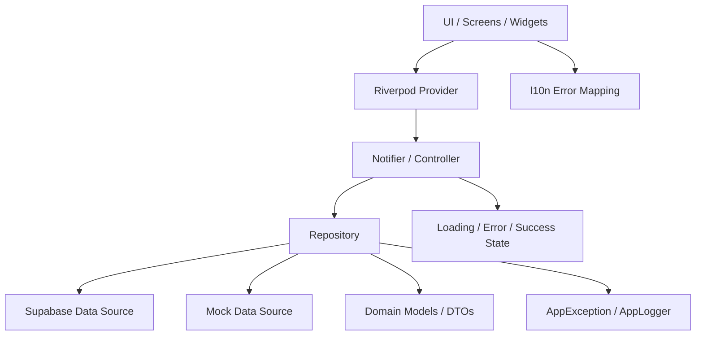

# Architecture & Data Flow

**Confidence / Verification Status**: `VERIFIED`

## Architecture Style
Moniary uses a **Feature-first** architecture combined with **Layered (Clean Architecture inspired)** principles.

1. **Presentation Layer (`presentation`)**: UI Widgets, Screens. Reads state from Providers.
2. **Application Layer (`application`)**: Riverpod Notifiers/Controllers. Handles UI logic and communicates with the Data layer.
3. **Domain Layer (`domain`)**: Data Models (Entities, DTOs).
4. **Data Layer (`data`)**: Repositories and Services. Connects to Supabase or returns Mock data.

## Data Flow

## Mock Data vs Supabase
Repositories check `AppConstants.hasSupabaseConfig`.
- If `true`: Execute Supabase queries.
- If `false`: Use in-memory mock lists (e.g., `TransactionRepository._mockTransactions`).

## Error Handling Boundary
- Data layer throws `AppException(message, code)`.
- Application layer catches it, updates the state to `AsyncError`, and logs via `AppLogger.error`.
- Presentation layer listens to errors and displays SnackBar/Dialog, typically using `context.l10n` to translate the error code/message.

## Rule of Thumb
- **NEVER** call `Supabase.instance.client` directly from a UI Widget.
- **NEVER** define UI strings or `BuildContext` logic inside a Repository.
